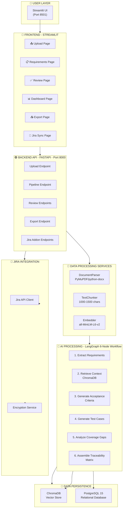
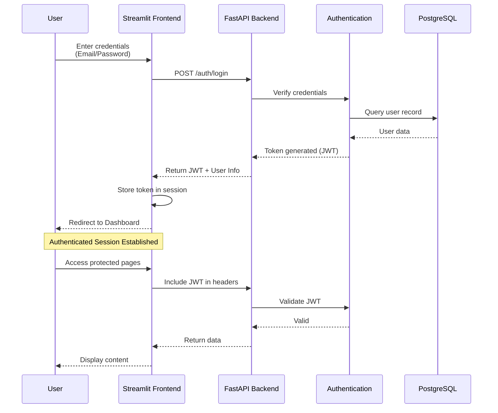
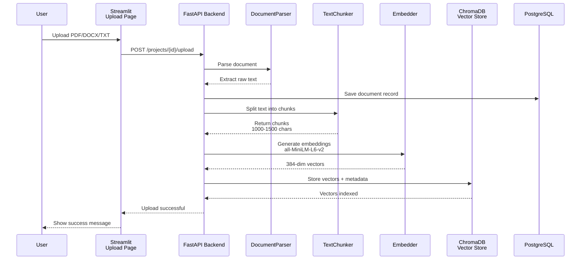
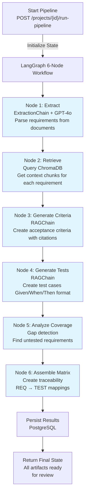
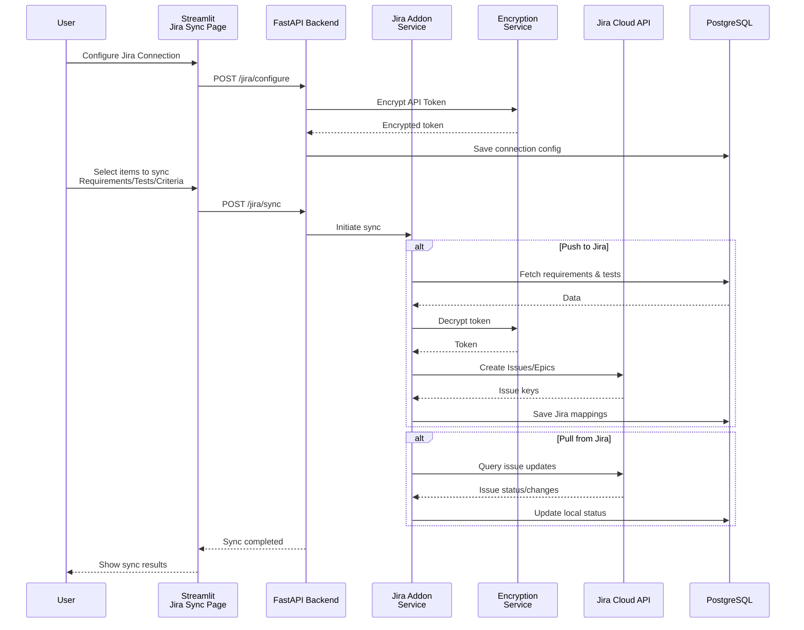
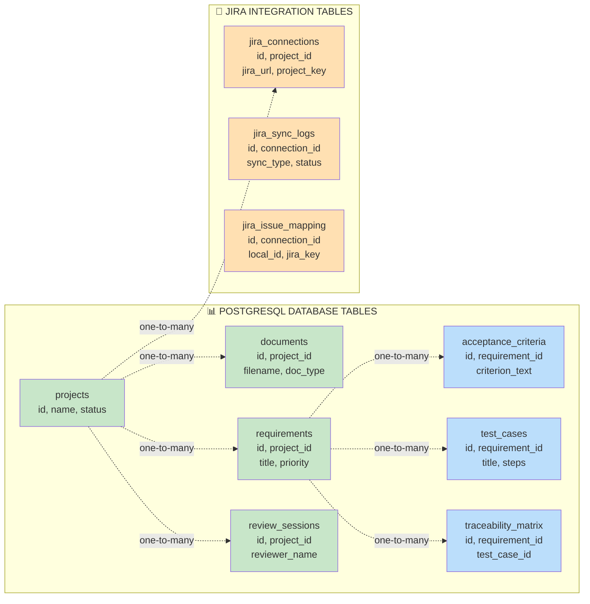

# Delivery Assurance Copilot - System Architecture

## Overview

Delivery Assurance Copilot is an AI-powered application that automates the extraction, generation, and management of software requirements, acceptance criteria, and test cases. It integrates with Jira for bidirectional synchronization and uses LangGraph for intelligent document processing workflows.

**Technology Stack:**
- **Frontend**: Streamlit (Python) - Port 8501
- **Backend**: FastAPI (Python) - Port 8000
- **AI/ML**: LangChain, LangGraph, GPT-4o
- **Vector Store**: ChromaDB (local)
- **Database**: PostgreSQL 15 with asyncpg
- **Integration**: Jira Cloud API with encrypted token storage
- **Containerization**: Docker & Docker Compose

---

## System Architecture Diagram



---

## Layer 1: Frontend (Streamlit) - Port 8501

### Pages & Features

| Page | Purpose | Key Actions |
|------|---------|------------|
| **Login** | User authentication | Email/password login, session management |
| **Upload** | Document ingestion | Upload PDF/DOCX/TXT files to project |
| **Requirements** | View extracted requirements | View AI-generated requirements with status |
| **Review** | Approve/edit artifacts | Review and approve requirements, criteria, tests |
| **Dashboard** | Pipeline monitoring | Real-time metrics and processing status |
| **Export** | Download results | Export to CSV/JSON, download traceability matrix |
| **Jira Sync** | Bidirectional sync | Configure Jira connection, push/pull data |

---

## Layer 2: Backend API (FastAPI) - Port 8000

### API Endpoints

```mermaid
graph TB
    subgraph API["API ENDPOINTS"]
        Auth["🔐 Authentication"]
        Upload["📤 Upload Documents"]
        Pipeline["⚡ Pipeline Processing"]
        Review["✅ Review & Approval"]
        Export["📥 Export Results"]
        Jira["🔗 Jira Sync"]
    end
    
    subgraph AuthEP["Authentication Endpoints"]
        A1["POST /auth/login<br/>Email + Password"]
        A2["POST /auth/logout<br/>Clear session"]
        A3["POST /auth/register<br/>Create new user"]
    end
    
    subgraph UploadEP["Upload Endpoints"]
        U1["POST /projects/{id}/upload<br/>File: PDF/DOCX/TXT"]
        U2["GET /projects/{id}/documents<br/>List uploaded docs"]
    end
    
    subgraph PipelineEP["Pipeline Endpoints"]
        P1["POST /projects/{id}/run-pipeline<br/>Start 6-node workflow"]
        P2["GET /projects/{id}/status<br/>Pipeline progress"]
        P3["GET /projects/{id}/requirements<br/>View extracted"]
    end
    
    subgraph ReviewEP["Review Endpoints"]
        R1["GET /requirements/{id}<br/>View requirement"]
        R2["PUT /requirements/{id}<br/>Approve/Reject/Edit"]
        R3["GET /test-cases/{id}<br/>View test case"]
    end
    
    subgraph ExportEP["Export Endpoints"]
        E1["GET /projects/{id}/export/csv<br/>Download CSV"]
        E2["GET /projects/{id}/export/json<br/>Download JSON"]
        E3["GET /projects/{id}/traceability<br/>Traceability matrix"]
    end
    
    subgraph JiraEP["Jira Sync Endpoints"]
        J1["POST /jira/configure<br/>Save Jira connection"]
        J2["POST /jira/sync<br/>Start bidirectional sync"]
        J3["GET /jira/status<br/>Sync status"]
        J4["POST /jira/webhook<br/>Receive updates from Jira"]
    end
    
    Auth --> A1
    Auth --> A2
    Auth --> A3
    Upload --> U1
    Upload --> U2
    Pipeline --> P1
    Pipeline --> P2
    Pipeline --> P3
    Review --> R1
    Review --> R2
    Review --> R3
    Export --> E1
    Export --> E2
    Export --> E3
    Jira --> J1
    Jira --> J2
    Jira --> J3
    Jira --> J4
```



---

## Layer 3: Authentication Flow

### Login & Session Management



**Key Points:**
- JWT-based stateless authentication
- Credentials verified against PostgreSQL user table
- Token stored in Streamlit session for request headers
- All API calls require valid JWT in `Authorization` header

---

## Layer 4: Document Upload & Processing Flow

### Upload Pipeline



**Processing Steps:**

1. **Document Parsing**: Extract text from PDF/DOCX/TXT using PyMuPDF or python-docx
2. **Text Chunking**: Split text into overlapping chunks (1000-1500 chars, 200-char overlap)
3. **Embedding Generation**: Convert chunks to 384-dim vectors using all-MiniLM-L6-v2
4. **Vector Storage**: Index vectors in ChromaDB for semantic search
5. **Metadata Persistence**: Store document metadata in PostgreSQL

---

## Layer 5: AI Processing - LangGraph 6-Node Workflow

### Core Pipeline Architecture



### Workflow State Definition

```python
WorkflowState = TypedDict({
    "project_id": str,
    "document_ids": List[str],
    "raw_document_texts": List[str],
    "requirements": List[ExtractedRequirement],
    "retrieved_chunks": Dict[str, List[str]],
    "acceptance_criteria": Dict[str, List[str]],
    "test_cases": List[TestCase],
    "coverage_gaps": List[str],
    "traceability_matrix": List[TraceabilityRecord],
    "errors": List[str]
})
```

### Node Details

| Node | Input | Processing | Output |
|------|-------|-----------|--------|
| **Extract** | Raw document text | ExtractionChain + GPT-4o | `List[ExtractedRequirement]` |
| **Retrieve** | Requirements | ChromaDB semantic search | `Dict[req_id, chunks]` |
| **Generate Criteria** | Requirements + chunks | RAGChain + GPT-4o | `Dict[req_id, criteria]` |
| **Generate Tests** | Requirements + criteria | RAGChain + GPT-4o (BDD format) | `List[TestCase]` |
| **Analyze Coverage** | Requirements + tests | Gap analysis logic | `List[CoverageGap]` |
| **Assemble Matrix** | All above | Create mappings | `List[TraceabilityRecord]` |

---

## Layer 6: Jira Bidirectional Sync

### Jira Sync Flow



### Jira Integration Features

- **Push Sync**: Export requirements and test cases to Jira as issues
- **Pull Sync**: Import status updates from Jira back to local artifacts
- **Auto-Linking**: Automatically link requirements to test cases in Jira
- **Organization**: Group synced items under parent epics
- **Security**: Encrypt all API tokens at rest using Fernet encryption
- **Webhook Support**: Receive real-time updates from Jira webhooks

### Configuration Flow

1. User enters Jira URL, Project Key, Email, and API Token
2. Backend validates connection with Jira Cloud API
3. API token encrypted and stored in PostgreSQL
4. Connection status persisted for future syncs
5. Sync operations use stored encrypted credentials

---

## Layer 7: Data Persistence

### Database Schema



### Core Tables

**Projects**
- `id` (UUID, PK)
- `name` (String)
- `description` (Text)
- `status` (Enum: active, archived)
- `created_at`, `updated_at` (Timestamp)

**Documents**
- `id` (UUID, PK)
- `project_id` (UUID, FK)
- `filename` (String)
- `doc_type` (Enum: PDF, DOCX, TXT)
- `status` (Enum: uploaded, processed, indexed)
- `created_at` (Timestamp)

**Requirements**
- `id` (UUID, PK)
- `project_id` (UUID, FK)
- `req_id` (String, unique per project)
- `title` (String)
- `description` (Text)
- `priority` (Enum: high, medium, low)
- `ambiguity_flag` (Boolean)
- `reviewer_status` (Enum: pending, approved, rejected)

**Acceptance Criteria**
- `id` (UUID, PK)
- `requirement_id` (UUID, FK)
- `criterion_text` (Text)
- `source_citation` (Text)
- `reviewer_status` (Enum: pending, approved, rejected)

**Test Cases**
- `id` (UUID, PK)
- `requirement_id` (UUID, FK)
- `title` (String)
- `given` (Text) - Setup
- `when` (Text) - Action
- `then` (Text) - Expected result
- `priority` (Enum: high, medium, low)
- `reviewer_status` (Enum: pending, approved, rejected)

**Traceability Matrix**
- `id` (UUID, PK)
- `project_id` (UUID, FK)
- `requirement_id` (UUID, FK)
- `test_case_id` (UUID, FK)
- `coverage_status` (Enum: covered, partial, uncovered)

**Review Sessions**
- `id` (UUID, PK)
- `project_id` (UUID, FK)
- `reviewer_name` (String)
- `status` (Enum: active, completed)
- `created_at`, `completed_at` (Timestamp)

### Jira Integration Tables

**Jira Connections**
- `id` (UUID, PK)
- `project_id` (UUID, FK, unique)
- `jira_url` (String)
- `project_key` (String)
- `email` (String)
- `api_token_encrypted` (String)
- `is_valid` (Boolean)
- `created_at`, `last_synced` (Timestamp)

**Jira Sync Logs**
- `id` (UUID, PK)
- `connection_id` (UUID, FK)
- `sync_type` (Enum: push, pull, bidirectional)
- `status` (Enum: pending, running, completed, failed)
- `items_synced` (Integer)
- `error_message` (Text, nullable)
- `created_at`, `completed_at` (Timestamp)

**Jira Issue Mapping**
- `id` (UUID, PK)
- `connection_id` (UUID, FK)
- `local_id` (UUID) - Local requirement/test case ID
- `local_type` (Enum: requirement, test_case, criteria)
- `jira_key` (String) - Jira issue key (e.g., QUAL-123)
- `jira_url` (String)
- `last_synced` (Timestamp)

---

## Data Flow Summary

### Complete Request-to-Result Flow

1. **User Login** → Authenticate with email/password → Receive JWT token
2. **Upload Documents** → POST `/projects/{id}/upload` → Parse → Chunk → Embed → Index in ChromaDB
3. **Run Pipeline** → POST `/projects/{id}/run-pipeline` → Start LangGraph workflow
4. **Extraction** → GPT-4o extracts requirements from documents
5. **Context Retrieval** → ChromaDB returns relevant chunks for each requirement
6. **Generation** → RAGChain generates acceptance criteria and test cases
7. **Analysis** → Identify coverage gaps and create traceability matrix
8. **Persistence** → Store all results in PostgreSQL
9. **Review** → User reviews and approves artifacts via Review page
10. **Export** → Download results as CSV/JSON with full traceability
11. **Jira Sync** → Push to Jira or pull status updates (optional)

---

## Technology Components

### Backend Services

| Service | Purpose | Technology |
|---------|---------|-----------|
| **DocumentParser** | Extract text from files | PyMuPDF, python-docx |
| **TextChunker** | Split text into overlapping chunks | LangChain RecursiveCharacterTextSplitter |
| **Embedder** | Generate vector embeddings | sentence-transformers (all-MiniLM-L6-v2) |
| **ExtractionChain** | Extract requirements using AI | LangChain + GPT-4o |
| **RAGChain** | Generate criteria/tests with context | LangChain RAG + GPT-4o |
| **LangGraph Workflow** | Orchestrate 6-node pipeline | LangGraph |
| **Jira Client** | Communicate with Jira API | requests library + Jira Python SDK |
| **Encryption Service** | Encrypt/decrypt sensitive data | cryptography (Fernet) |

### Storage & Vector DB

| Component | Purpose | Details |
|-----------|---------|---------|
| **PostgreSQL 15** | Primary relational database | asyncpg driver, SQLAlchemy 2.0 ORM |
| **ChromaDB** | Vector store for embeddings | Local persistent database, semantic search |

### External Services

| Service | Purpose | Integration |
|---------|---------|-----------|
| **OpenAI GPT-4o** | LLM for extraction/generation | LangChain integration |
| **Jira Cloud API** | Issue management sync | Bidirectional with webhook support |

---

## Deployment Architecture

### Docker Composition

```yaml
Services:
  - frontend (Streamlit) - Port 8501
  - backend (FastAPI) - Port 8000
  - postgres (PostgreSQL 15) - Port 5432
  - chromadb (Vector Store) - Internal network

Volumes:
  - postgres_data (database persistence)
  - chromadb_data (vector store persistence)
  - uploads (user uploaded files)
```

### Network Configuration

- **Frontend → Backend**: HTTP requests on internal network
- **Backend → PostgreSQL**: TCP connection with asyncpg
- **Backend → ChromaDB**: HTTP requests on internal network
- **Backend → Jira**: HTTPS to Jira Cloud API
- **Users → Frontend**: HTTP on Port 8501

---

## Security Considerations

1. **Authentication**: JWT-based token authentication
2. **API Credentials**: Encrypted Jira API tokens stored in PostgreSQL
3. **Database Access**: Async connections with connection pooling
4. **File Upload**: Stored in dedicated `uploads/` directory with validation
5. **Environment Variables**: Sensitive config via `.env` file (not in repo)
6. **Webhook Validation**: Verify Jira webhook signatures

---

## Performance Features

- **Vector Search**: Fast semantic similarity search via ChromaDB embeddings
- **Connection Pooling**: Async database connections with asyncpg
- **Parallel Processing**: LangGraph enables concurrent node execution where possible
- **Caching**: ChromaDB caches embeddings for repeated queries
- **Chunking Strategy**: Overlapping chunks (200-char overlap) for context preservation

---

## Error Handling & Monitoring

- **Pipeline State Management**: LangGraph tracks state through workflow
- **Error Logging**: Errors stored in workflow state for review
- **Sync Logging**: Jira sync operations logged with status and item counts
- **Dashboard Metrics**: Real-time pipeline progress tracking
- **Exception Handling**: Try-catch blocks at API endpoints with user-friendly messages

---

## Extensibility

- **Addon Architecture**: Jira addon is modular and can be extended with other integrations
- **Custom Chains**: LangChain chains can be customized for different document types
- **Database Migrations**: SQLAlchemy enables schema evolution
- **API Versioning**: FastAPI supports multiple API versions
- **Configuration Management**: Environment-based configuration for different deployments

